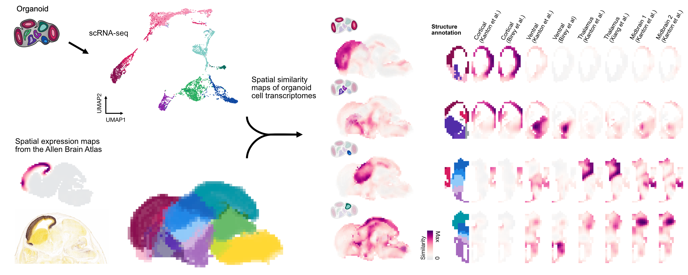

# VoxHunt 

## Introduction 

Brain organoids are complex and can contain cells at various stages of differentiation from different brain structures. Single cell genomic methods provide  powerful approaches to explore cell composition, differentiation trajectories, gene regulation, and genetic perturbations in brain organoid systems. VoxHunt is a handy little tool to assess brain organoid patterning, developmental state, and cell composition through systematic comparisons to three-dimensional in situ hybridization data from the Allen Brain Atlas.

## Installation

